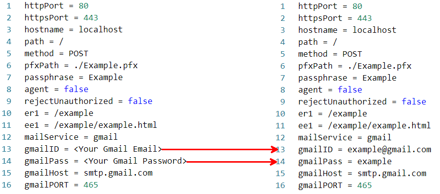
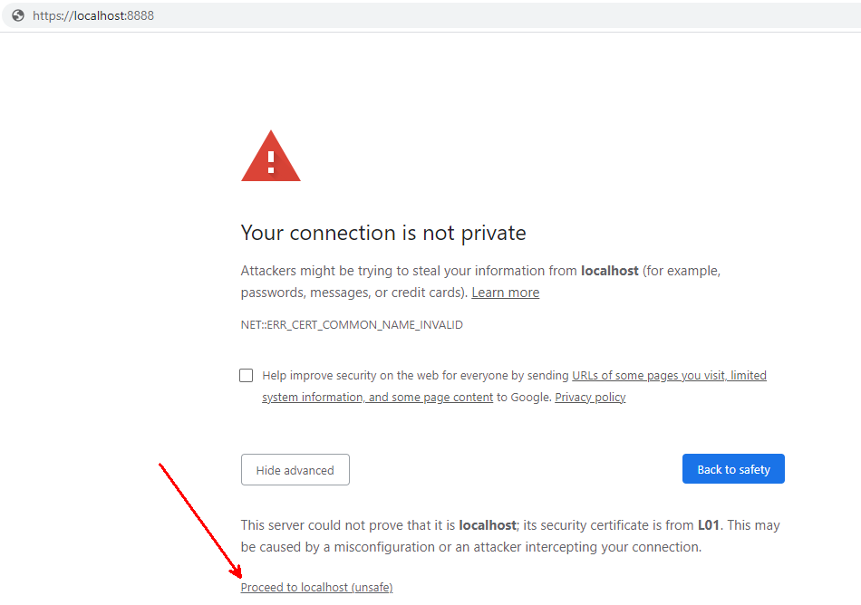

<p align="center">
  
</p> 
<h1 align="center">ScaleFocus Project - Team Crypto Zargan</h1>

## Website

https://cryptozargan.studio

---

We have implemented the Bletchley game with HTML / CSS / JS. Our project consists of singleplayer module and multiplayer module. The singleplayer includes three difficulties - Easy, Medium and Hard. The multiplayer allows one player to play as the Germans and create the code which the other player has to guess.

## Technologies

-    HTML
-    CSS
-    JavaScript

## Features

-   [x] 3 singleplayer difficulties
-   [x] Multiplayer mode
-   [x] Bulgarian and English localisation

---

## How to run the project on your machine

### Step 1: Clone the repository

Open your terminal and clone the repository.

```
git clone https://github.com/IPBachvarov18/CryptoZargan.git
cd CryptoZargan
npm install
```

### Step 2: Rename `.env.example` to `.env`

### Step 3: Enter your gmail account



### Step 4: Run the project

```
node .
```

### Step 5: Go to `https:/localhost:8888`


